# Elite Portfolio - Full Stack Developer

A comprehensive, production-ready developer portfolio featuring a modern React frontend. Designed to impress recruiters with smooth animations, responsive design, and professional presentation leveraging cutting-edge web technologies.

## 🌐 Live Demo

**Portfolio Website:** [https://sarthaksrivastava.netlify.app/](https://sarthaksrivastava.netlify.app/)

Deployed on: **Netlify**

### Featured Preview

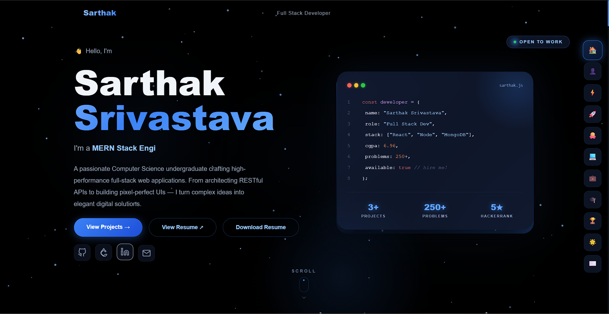

---

## 🏗️ Architecture

This is a frontend-focused portfolio application built with modern web technologies:

### Frontend (Client)
- **Framework**: React 19 with Vite
- **Styling**: Tailwind CSS with custom design system
- **Animations**: Framer Motion for smooth interactions
- **Features**: Responsive design, dark theme, scroll animations
- **Additional**: GitHub Calendar integration, LeetCode stats, Recharts visualization

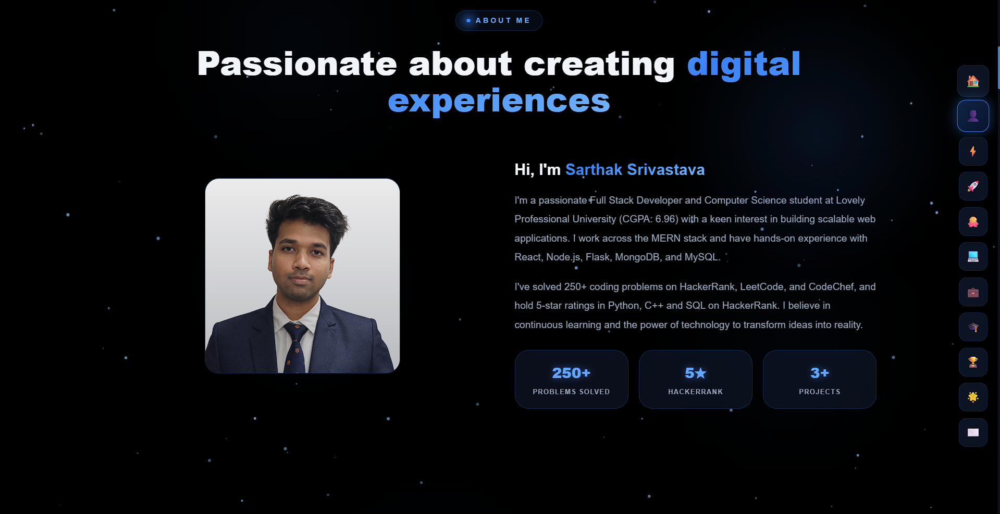

## 🚀 Quick Start

### Prerequisites
- Node.js (v16+)
- npm or yarn

### Installation

1. **Clone the repository:**
```bash
git clone <repository-url>
cd Elite-Portfolio/client
```

2. **Install dependencies:**
```bash
npm install
```

3. **Start the development server:**
```bash
npm run dev
```

4. **Open your browser:**
Navigate to [http://localhost:5173](http://localhost:5173)

## 📁 Project Structure

```
Elite-Portfolio/
├── client/                 # React frontend
│   ├── public/            # Static assets
│   ├── src/
│   │   ├── assets/        # Images, certificates, and icons
│   │   ├── components/    # Reusable UI components
│   │   │   ├── Hero.jsx
│   │   │   ├── Navbar.jsx
│   │   │   ├── Footer.jsx
│   │   │   └── GlobalBackground.jsx
│   │   ├── data/          # Static data files
│   │   │   ├── projects.js
│   │   │   ├── certificates.js
│   │   │   ├── education.js
│   │   │   └── experience.js
│   │   ├── pages/         # Page components
│   │   │   ├── Home.jsx
│   │   │   ├── About.jsx
│   │   │   ├── Skills.jsx
│   │   │   ├── Projects.jsx
│   │   │   ├── Education.jsx
│   │   │   ├── Experience.jsx
│   │   │   ├── Certificates.jsx
│   │   │   ├── Achievements.jsx
│   │   │   ├── Contact.jsx
│   │   │   ├── GithubStats.jsx
│   │   │   └── LeetcodeStats.jsx
│   │   ├── App.jsx        # Main app component
│   │   ├── main.jsx       # App entry point
│   │   └── CSS files      # Styling
│   ├── package.json
│   └── README.md
└── README.md              # This file
```

## 🎨 Design Features

- **Dark Theme**: Professional slate-950 background with cyan accents
- **Responsive**: Mobile-first design for all screen sizes
- **Animations**: Smooth scroll reveals, hover effects, and counters
- **Typography**: Syne for headings, DM Sans for body text
- **Glassmorphism**: Modern frosted glass effects

## 🛠️ Tech Stack

### Frontend
- React 19
- Vite (build tool)
- Tailwind CSS
- Framer Motion
- Recharts (data visualization)
- React GitHub Calendar
- ESLint

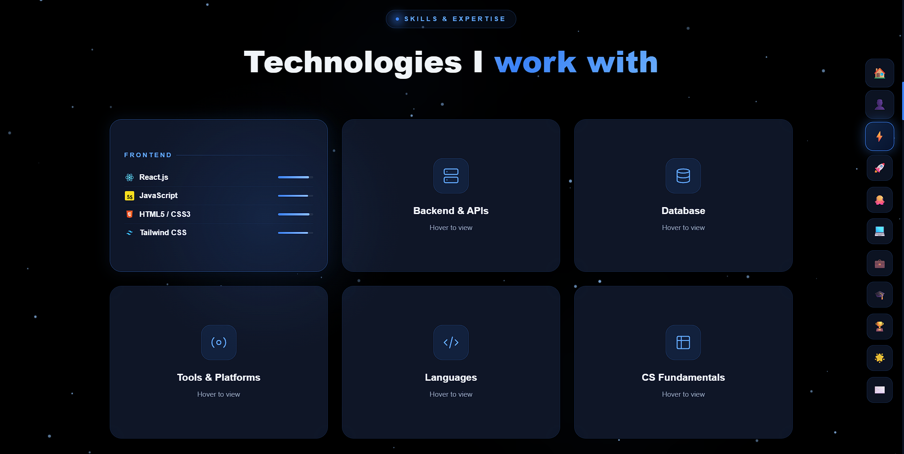

## 📊 Portfolio Sections

1. **Hero** - Introduction with social links and resume download
2. **About** - Personal profile with key statistics
3. **Skills** - Technical skills with proficiency indicators
4. **Projects** - Featured work with live demos and GitHub links
5. **Education** - Academic background timeline
6. **Experience** - Professional training and experience
7. **Certificates** - Professional certifications grid
8. **Achievements** - Key metrics and accomplishments
9. **GitHub Stats** - GitHub contribution calendar and activity
10. **LeetCode Stats** - LeetCode performance metrics and progress
11. **Contact** - Contact form with validation
12. **Footer** - Social links and back-to-top button

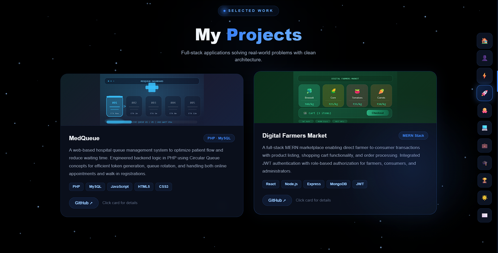

## 🔧 Development

### Available Scripts

**Frontend:**
```bash
cd client
npm run dev      # Start development server
npm run build    # Build for production
npm run preview  # Preview production build
npm run lint     # Run ESLint
```

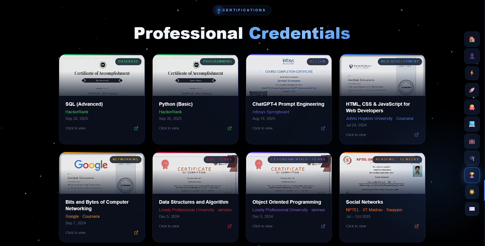

## 📸 Screenshots Gallery

Explore the portfolio sections:

### Hero Section

*Introduction with personal branding, role, and quick stats*

### About Section

*Personal profile with achievements and key metrics*

### Skills & Expertise

*Technology stack organized by Frontend, Backend, Database, Tools, Languages, and CS Fundamentals*

### Projects Showcase

*Featured full-stack projects with live demos and GitHub links*

### Project Card Details
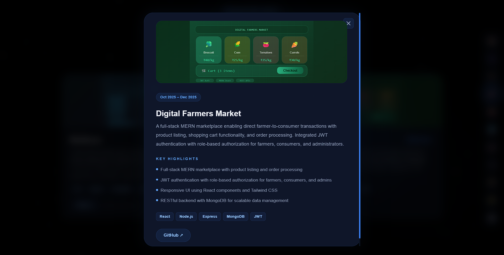
*Individual project details with technologies and links*

### Education Timeline
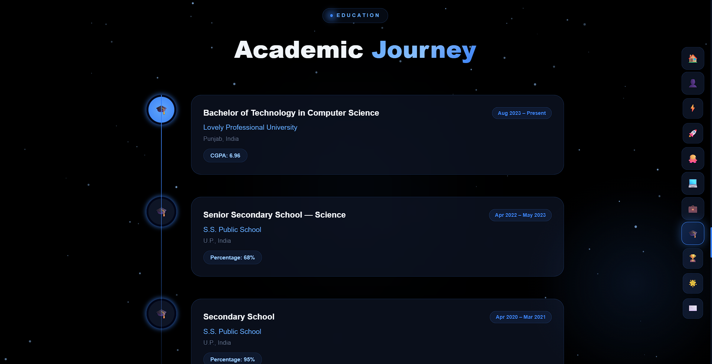
*Academic journey with degrees and institutions*

### Professional Certifications

*Professional credentials and online course completions*

### Achievements & Stats
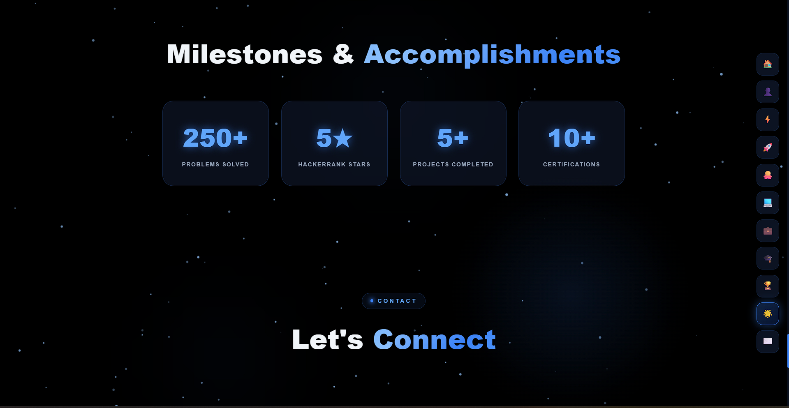
*Key accomplishments and performance metrics*

### Certificate Cards
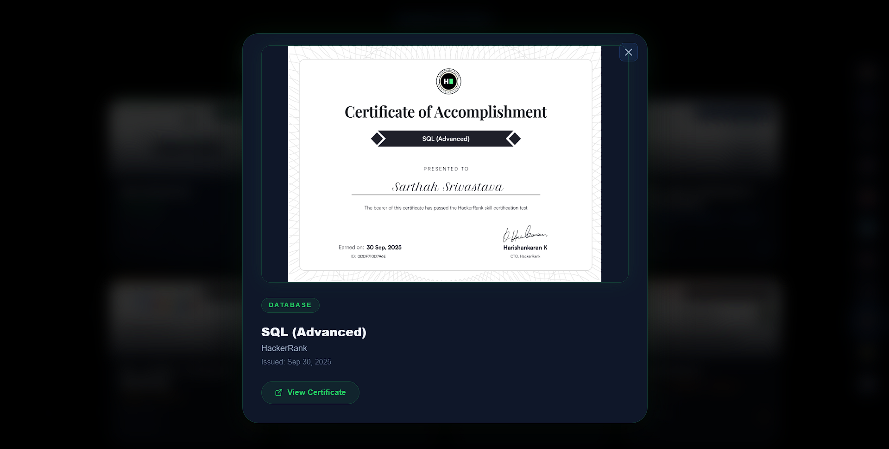
*Individual certificate display with details*

### Experience & Training
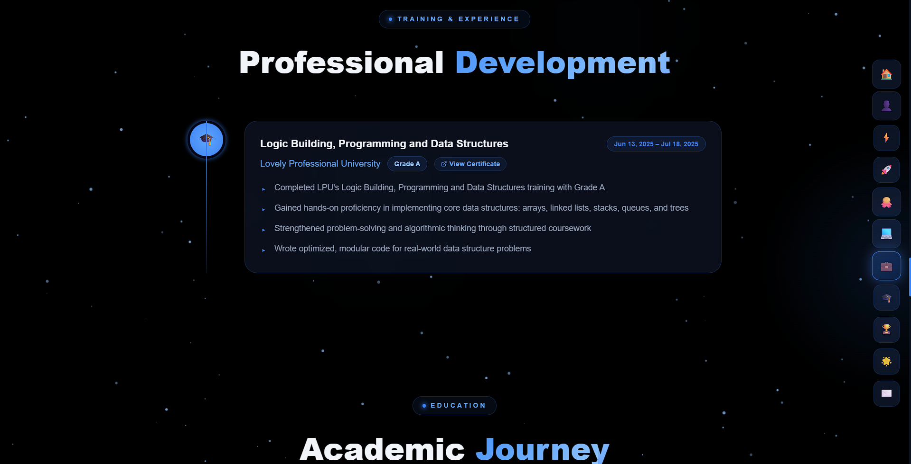
*Professional training and internship experiences*

### GitHub Statistics
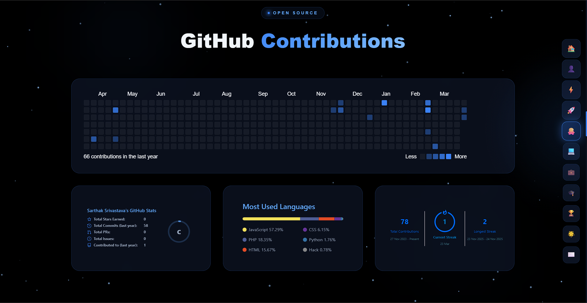
*Contribution calendar and GitHub activity metrics*

### LeetCode Performance
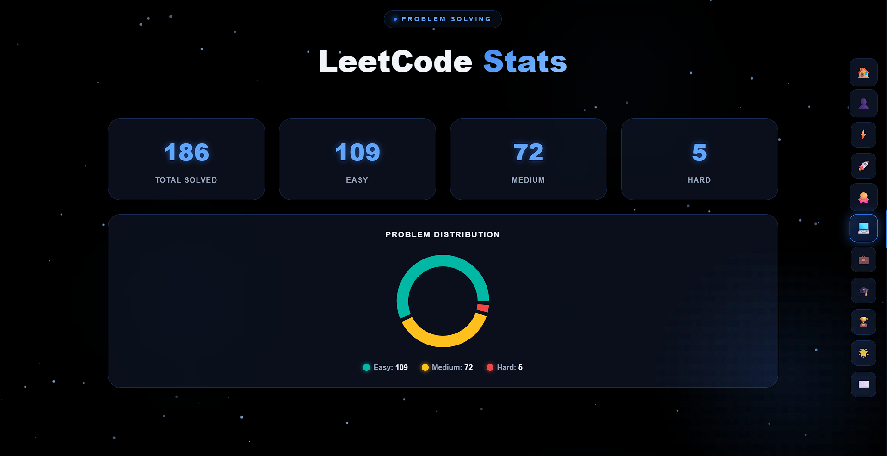
*Coding practice performance and problem-solving stats*

### Contact Section
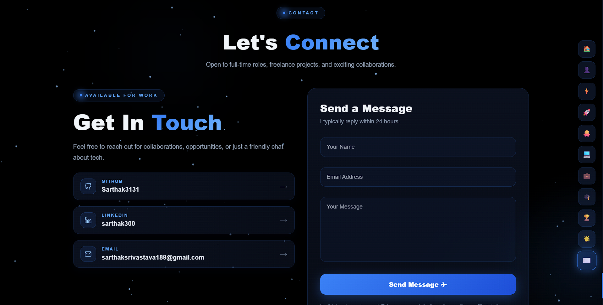
*Contact form and communication channels*

### Footer
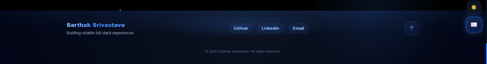
*Social links and back-to-top navigation*

---

## 📱 Mobile Responsiveness

The portfolio is fully responsive with breakpoints:
- Mobile: < 768px
- Tablet: 768px - 1024px
- Desktop: > 1024px

## 🎯 Performance

- **Fast Loading**: Vite's optimized build system
- **Code Splitting**: Automatic route-based splitting
- **Image Optimization**: Lazy loading and modern formats
- **Caching**: Efficient asset caching strategies

## 🔒 Security

- CORS configuration
- Input validation
- Environment variable protection
- Secure headers

## 📈 Future Enhancements

- [ ] Add blog section
- [ ] Implement dark/light theme toggle
- [ ] Add admin dashboard for content management
- [ ] Integrate with headless CMS
- [ ] Add analytics tracking
- [ ] Implement contact form email notifications

## 📄 License

This project is licensed under the MIT License - see the [LICENSE](LICENSE) file for details.

## 👨‍💻 Author

**Sarthak Srivastava**
- Full Stack Developer
- Portfolio: [Live Demo](https://sarthaksrivastava.netlify.app/)
- LinkedIn: [linkedin.com/in/sarthak300](https://www.linkedin.com/in/sarthak300/)
- GitHub: [github.com/Sarthak3131](https://github.com/Sarthak3131)
- Email: sarthaksrivastava189@gmail.com

---

⭐ If you found this project helpful, please give it a star!